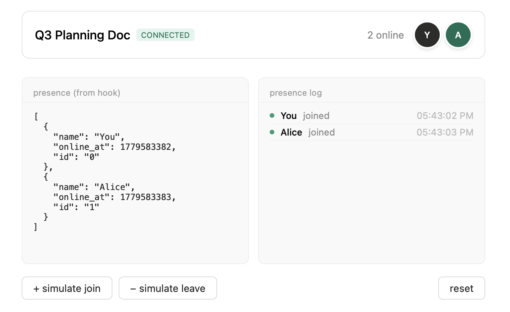

# phoenix-presence-react

React hook for [Phoenix Presence](https://hexdocs.pm/phoenix/Phoenix.Presence.html). Tracks who's online in real time via Phoenix channels.

Screenshot from example app:




## Install

```bash
npm install phoenix-presence-react
```

## Usage

```tsx
import { usePresence } from "phoenix-presence-react";

function OnlineUsers({
  userId,
  userName,
}: {
  userId: string;
  userName: string;
}) {
  const { presence, isJoined } = usePresence({
    topic: "presence:lobby",
    params: { token: "user-token" }, // params passed to your Elixir channel's join/3
  });

  return (
    <div>
      <div className={isJoined ? "status-online" : "status-connecting"} />
      {presence.map((user) => (
        <Avatar
          key={user.id}
          name={user.name} // 'name' comes from metadata tracked in Elixir
        />
      ))}
    </div>
  );
}
```

## Advanced Usage

### Typed Metadata

```tsx
interface MyMeta {
  name: string;
  avatar_url: string;
}

// 'presence' will be typed as (MyMeta & { id: string })[]
const { presence } = usePresence<MyMeta>({ topic: "room" });
```

### Callbacks for side effects

```tsx
usePresence({
  topic: "room",
  onJoin: (id, current, newPres) => {
    console.log(`${newPres.metas[0].name} joined!`);
  },
  onLeave: (id, current, leftPres) => {
    console.log(`${leftPres.metas[0].name} left!`);
  },
});
```

### Access raw Presence state

```tsx
const { state } = usePresence({ topic: "room" });
/* 
state is the raw Phoenix Record:
{
  "user-1": { metas: [{ name: "Alice", phx_ref: "..." }] },
  "user-2": { metas: [{ name: "Bob", phx_ref: "..." }] }
}
*/
```

## Options

```ts
usePresence({
  topic: "presence:lobby", // Default: "presence:lobby"
  params: { token: "..." }, // Params for socket/channel
  socketUrl: "/socket", // Default: "/socket" (only used if no socket/channel provided)
  socket: externalSocket, // Optional: provide existing Phoenix Socket
  channel: externalChannel, // Optional: provide existing Phoenix Channel
});
```

## Return value

```ts
{
  presence: (PresenceMeta & { id: string })[], // Flattened list of online users
  state: Record<string, { metas: any[] }>,     // Raw Phoenix presence state
  isJoined: boolean,                           // Channel join status
  error: Error | null,                         // Join error
}
```

## Required Elixir backend

You need a Phoenix channel using `Phoenix.Presence`.

### 1. Define your Presence module

```elixir
defmodule MyAppWeb.Presence do
  use Phoenix.Presence,
    otp_app: :my_app,
    pubsub_server: MyApp.PubSub
end
```

### 2. Update your Channel

```elixir
defmodule MyAppWeb.PresenceChannel do
  use MyAppWeb, :channel
  alias MyAppWeb.Presence

  def join("presence:lobby", _params, socket) do
    send(self(), :after_join)
    {:ok, socket}
  end

  def handle_info(:after_join, socket) do
    {:ok, _} = Presence.track(socket, socket.assigns.user_id, %{
      online_at: System.os_time(:second),
      name: socket.assigns.user_name
    })
    push(socket, "presence_state", Presence.list(socket))
    {:noreply, socket}
  end
end
```
